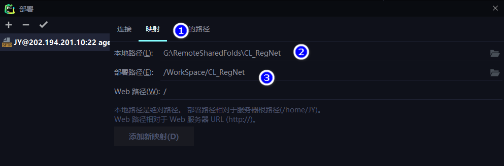
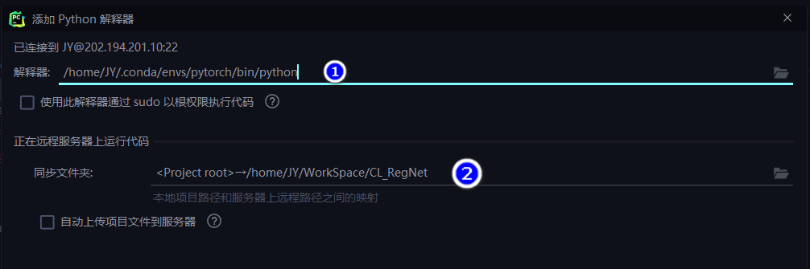

# PART Ⅲ  本地工作指南


## 事前准备

### 资格申请

#### GitHub学生开发包

[申请学生开发包](https://docs.github.com/cn/education/explore-the-benefits-of-teaching-and-learning-with-github-education/use-github-for-your-schoolwork/apply-for-a-student-developer-pack)

#### PyCharm professional

[PyCharm教育版](https://www.jetbrains.com/community/education/#students)，在GitHub学生开发包下来的情况下，可以不用申请这个。

## IDE工具

1. PyCharm
2. VS Code

常用的开发工具，Pycharm和VS Code至少安装一个。强烈不推荐VS Code

另有余力的话，建议在本地也配置一下深度学习的开发环境

## SSH管理工具

两款SSH管理工具提供了美化后的终端、可视化SFTP文件管理、以及其他的tricks，推荐安装

1. [Termius](https://termius.com/)
2. [FinalShell](http://www.hostbuf.com/t/988.html)

----

以下内容配置完服务器端后进行

## 客户端配置（windows）

### 客户端设置SSH

1. 设置→程序→搜索“添加可选功能”→添加功能→安装openssh

2. 打开终端输入，生成SSH公钥和私钥在路径C:\Users\dell\\.ssh

   ```
   ssh-keygen -t rsa -b 4096
   ```

3. 验证连通性

   ```
   ssh <USERNAME>@YOURSERVERIP
   exit
   ```

### 客户端把文件复制到服务器（不推荐）

1. 赋予当前客户端用户待复制的文件/文件夹读取权限

   ```
   # 注意分别在客户端和服务器端操作，读写权限已经设成777的可忽略本步骤
   sudo chmod 777 local_file_path #ubuntu客户端,windows可忽略
   sudo chmod 777 remote_file_path #服务器
   ```

2. 传输

   ```
   scp -r local_file_path <USERNAME>@<YOURSERVERIP>:remote_file_path #文件夹
   scp local_file_path <USERNAME>@<YOURSERVERIP>:remote_file_path #文件
   ```
   
## VSCode设置

1. 在左侧拓展处搜索remote -SSH，下载安装；搜索python，下载安装

2. 打开安装的“远程资源管理器”，选择SSH Target，点+号配置新连接 

   ```
   ssh <USERNAME>@YOURSERVERIP
   ```

   配置会以文件存储，一般选择默认的存储路径即可

3. 点齿轮，选择配置文件可以个性化修改

4. 连接：

   - 远程资源管理器→SSH Target，点击/右键连接

   - 如果没有把公钥上传服务器的话，需要输入用户密码；

   - 如果已上传服务器，可直接建立连接；


## PyCharm远控服务器教程

### 申请专业版PyCharm

首先申请专业版/教育版PyCharm，否则PyCharm无法满足我们的需求。

### 部署远程服务器

主要包括配置<u>远程python解释器</u>和<u>远程工作区与本地工作区映射关系</u>两个步骤。

**PyCharm的远控逻辑：**在本地和云端同步两个内容一致的文件夹，本地的更改会实时映射到云端，使用云端服务器的python解释器执行代码。

#### 几个推荐的插件

```
file→setting→plugin
或：文件→设置→插件
```

- Chinese(Simplified) Language Pack	汉化包
- CodeGlance3 类似于VSCode的右侧预览界面
- Material Theme UI 比较丰富的主题

#### 配置SSH服务器

```
文件→设置→工具→SSH配置
```


#### 部署远程映射

1. 打开配置界面

   ```
   工具→部署→配置
   ```


2. 点击“+”新建配置，选择SFTP

3. 选择我们配置好的ssh，配置远程服务器

   

4. 配置映射关系（此处可参考下文Tips中”一个理想的模板“）



选择**本地路径**和相应的**部署路径（即远程路径）**

a. **\<部署\>→\<映射\>→\<部署路径\>** 指的是相对于**\<部署\>→\<连接\>→\<根路径\>**的相对路径。也就是说：

```
根路径：/
部署路径：/home/<USERNAME>/WorkSpace/...
或者
根路径：/home/<USERNAME>
部署路径：/WorkSpace/...
```

以上两个是指的同一种情况。（请自行学习Ubuntu的文件结构）

b. 当你在一个项目中，修改了根目录的话，在其他项目中也会更改。**每次切换项目务必查看一下文件的映射关系，不要上传错位置**

#### 配置远程python解释器

1. 选择SSH解释器

```
文件→项目.Python解释器→添加SSH Python解释器→直接选择现有服务器配置
```


2. 配置解释器路径

解释器路径参照下图，同步文件夹参照上



### Tips

**浏览远程主机**

```
工具→部署→浏览远程主机这样你就可以浏览到远程服务器的文件了。但实际上，还是更推荐用Termius之类的ssh管理工具,更安全可靠。
```

需要注意的是：

```
当你配置的根目录为/时，可以查看整个服务器的目录
当你配置的根目录为/home/<USERNAME>时，只可以查看当前账户下目录
```

**一个理想的模板**

```
1. 在本地分别建立一个工程文件夹 /project 和一个数据文件夹 /database
2. 使用PyCharm建立映射
	根目录 /
	映射1 /project→/home/<USERNAME>/WorkSpace
	映射2 /database→/data/<USERNAME>/DATA
```
