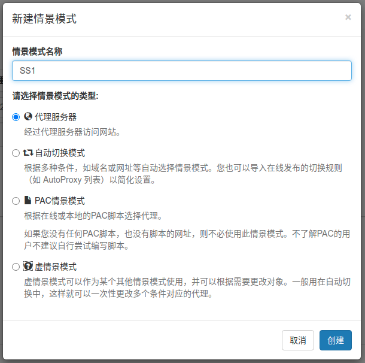
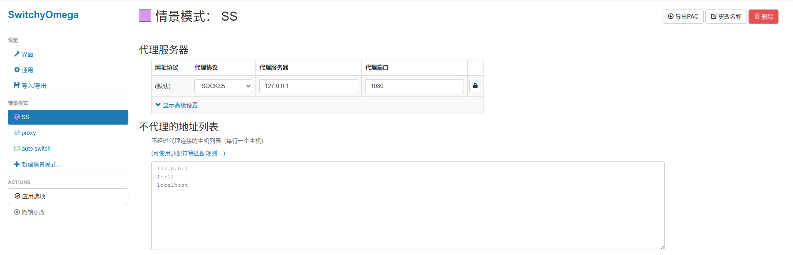
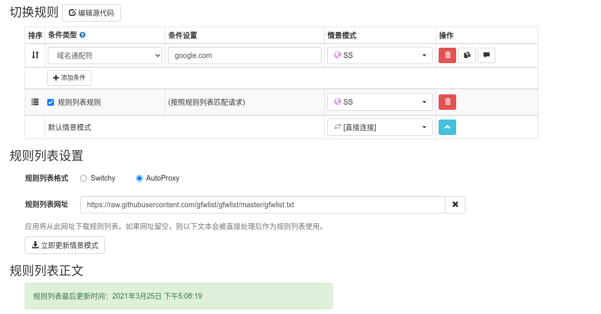

# 利用shadowsocks实现科学上网指南
## 配置shadowsocks

### 下载shadowsocks

`sudo pip install shadowsocks`

用下边指令验证是否安装成功

```
sslocal --help
sudo ssserver --version
```

### 配置shadowsocks

在/etc 下新建文件夹 shadowsocks，新建*.json文件

```
sudo mkdir /etc/shadowsocks
sudo vim /etc/shadowsocks/shadowsocks.json
```

在shadowsocks.json编辑以下内容

```
{
  "server":"::",
  "server_port":8388,
  "local_address": "127.0.0.1",
  "local_port":1080,
  "password":"123456789",
  "timeout":300,
  "method":"aes-256-cfb",
  "fast_open": false
}
```

### 启动shadowsocks

```
sslocal -c /etc/shadowsocks.json -d start
```

#### 可能存在的问题1

显示AttributeError:xxxx

解决方案：

由于在openssl1.1.0版本中，废弃了EVP_CIPHER_CTX_cleanup函数。根据报错信息，找到opensll.py文件，做以下修改：

```python
# 修改1
libcrypto.EVP_CIPHER_CTX_cleanup.argtypes = (c_void_p,)# 源代码
libcrypto.EVP_CIPHER_CTX_reset.argtypes = (c_void_p,)# 修改为

#修改2
libcrypto.EVP_CIPHER_CTX_cleanup(self._ctx)
libcrypto.EVP_CIPHER_CTX_reset(self._ctx)
```

#### 可能存在的问题2

```
[Errno 13] Permission denied: '/var/run/shadowsocks.pid'
[Errno 13] Permission denied: '/var/log/shadowsocks.log'
```

解决方案：

对应的文件没有访问权限，用chomd修改权限：

```
cd /var/log
sudo chmod -R 777 shadowsocks.log
```

777是所有用户都拥有最高权限

### 配置开机自启动

```
cd /etc/init.d/
vim shadowsocks.sh
```

*.sh文件内容

```
sslocal -c /etc/shadowsocks.json -d start;
exit 0
```

之后指令：

```
sudo chmod 755 shadowsocks.sh
sudo update-rc.d shadowsocks.sh defaults 95
```

## 配置chorme

### 安装SwitchyOmega插件

通过chorme插件Proxy SwitchyOmega实现代理配置，在其[官网](https://proxy-switchyomega.com/)或者[Github](https://github.com/FelisCatus/SwitchyOmega/releases/)下载*.crx文件（拓展文件）；

Chrome打开chrome://extensions/，将下载好的拓展文件拖入网页，安装。

### 配置代理信息

#### 情景模式



右侧新建情景模式，自定义名称，模式类型默认。



代理协议选择SOCKS5，根据shadowsocks.json中内容选择代理服务器和端口

应用选项

#### 设置auto switch

可以实现根据访问网址不同自动切换连接方式



有3种模式用于筛选网址：通过自定义条件类型选择连接模式、默认情景模式、规则列表设置。

可以直接在规则列表设置中，格式选择AutoProxy，网址填入下面网址：

```
https://raw.githubusercontent.com/gfwlist/gfwlist/master/gfwlist.txt
```

更新情景模式，应用选项完成配置。

## 使用Chrome开始上网

在插件处开启SwitchyOmega，开始上网