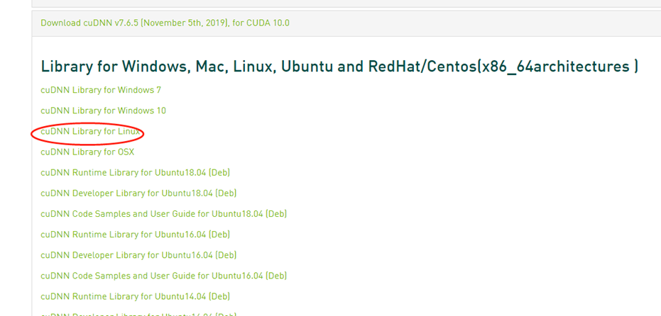

# PART Ⅳ 服务器端配置指南

## 创建新账户

1. 参考客户端教程，先连接服务器公用账户，来配置自己的私有账户

   ```
   ssh <公用账户名>@<YOURSERVERIP>
   ```

2. 新建用户, <USERNAME>是你自定义的用户名

   ```
   sudo useradd -g <公用账户名> -s /bin/bash -m <USERNAME>
   sudo passwd <USERNAME>
   ```

3. 切换用户

   ```
   su - <USERNAME>
   ```

4. 数据集和公共资源存储在机械硬盘

   ```
   mkdir /data/YOURFILENAME #新建文件夹
   sudo chmod 777 /data/YOURFILENAME #将你的文件夹权限改为全部可读可写
   ```

5. 更改权限

   ```
sudo chmod 754 /home/<USERNAME> #用户rwx;组rx;其他组r
   ```
   
6. 生成SSH密钥

   ```
   ssh-keygen -t rsa
   cd /home/<USERNAME>/.ssh
   ls
   # 并将客户端公钥.pub拷贝至上文件夹，重命名为authorized_keys
   ```

7. 可选：拷贝路径下的公钥 id_rsa.pub 中内容，复制并修改文件名为authorized_keys到服务器~\\.ssh中。可以避免每次都要输密码

8. (Anaconda已经安装好，在/home/anaconda3路径下，安装方案参见下文)配置conda环境变量

   ```
   echo 'export PATH="/home/anaconda3/bin:$PATH"' >> ~/.bashrc
   source ~/.bashrc
   conda init
   ```

9. 重启终端

10. 参照下文配置清华源
    https://mirrors.tuna.tsinghua.edu.cn/help/anaconda/

11. 按需配置开发环境, ENVNAME是你自定义的虚拟环境名

    ```
    conda create -n ENVNAME python=3.8
    conda activate ENVNAME
    conda install pytorch torchvision torchaudio cudatoolkit=11.1 -c pytorch-lts -c nvidia
    ```

12. 配置cuda路径

    ```
    echo 'export PATH="/usr/local/cuda-11.1/bin:$PATH"' >> ~/.bashrc
    source ~/.bashrc
    ```

13. 此后可以在客户端连接我们自己的账户

    ````
    ssh <USERNAME>@<YOURSERVERIP>
    ````

## 开发环境配置

### Anaconda

在清华源下载[Anaconda3-2021.11-Linux-x86_64.sh](https://mirrors.tuna.tsinghua.edu.cn/anaconda/archive/Anaconda3-2021.11-Linux-x86_64.sh)

安装：

```
bash Anaconda3-2021.11-Linux-x86_64.sh
按照指引安装，注意需要指定安装路径 /home/anaconda3
-----
对个人用户来说，需要用的时候
添加环境变量
方法1: vim ~/.bashrc 在结尾加上一行 export PATH="/home/anaconda3/bin:$PATH"
方法2: echo 'export PATH="/home/anaconda3/bin:$PATH"' >> ~/.bashrc
```

### PyTorch

进入预定的虚拟环境后，执行下述语句即可

```
conda install pytorch torchvision torchaudio cudatoolkit=11.1 -c pytorch-lts -c nvidia
```

### TensorFlow-gpu 1

**重要提醒：tensorflow-gpu、cuda、cudnn（、keras）版本号一定要对应**建议按照本教程中的版本号来安装。

#### 安装显卡驱动

已安装

#### 新建环境

创建一个conda环境，避免拓展包等冲突

   ```
conda create -n <YOURENVNAME> python=3.x
source activate <YOURENVNAME>
   ```

#### 安装tensorflow-gpu

   ```
pip install tensorflow-gpu==1.13.1
   ```

#### 安装cuda（刘洋版本）

下载cuda安装包：访问 https://developer.nvidia.com/cuda-toolkit-archive

执行：sudo sh cuda_10.0.130_410.48_linux.run

**在安装过程中两个需要输入路径的地方是CUDA安装路径，需要记录。将大概类似于/home/<USRENAME>/CUDA**

变量配置，执行：vim ~/.bashrc，在最后添加以下三句话

   ```
export PATH="/home/<USRENAME>/CUDA/bin:$PATH" 
export LD_LIBRARY_PATH="/home/<USRENAME>/CUDA/lib64:$LD_LIBRARY_PATH" 
export CUDA_HOME=“/home/<USRENAME>/CUDA”
   ```

完成之后执行：source ~/.bashrc，然后再次进入你的环境，执行nvcc -V，查到cuda版本说明安装成功。

#### 安装cudnn

访问https://developer.nvidia.com/rdp/cudnn-archive 



 下载安装包并解压，得到cuda文件夹

执行以下指令：

   ```
cp /home/<USRENAME>/CUDA/cuda/include/cudnn.h /home/<USRENAME>/CUDA/include
cp /home/<USRENAME>/CUDA/cuda/lib64/libcudnn /home/<USRENAME>/CUDA/cuda-9.0/lib64
chmod a+r /home/<USRENAME>/CUDA/include/cudnn.h /home/<USRENAME>/CUDA/lib64/libcudnn
   ```

#### 验证是否成功

输入python，此时可以写python语句。输入：import tensorflow，按下回车，如果没有报错，则安装成功。
